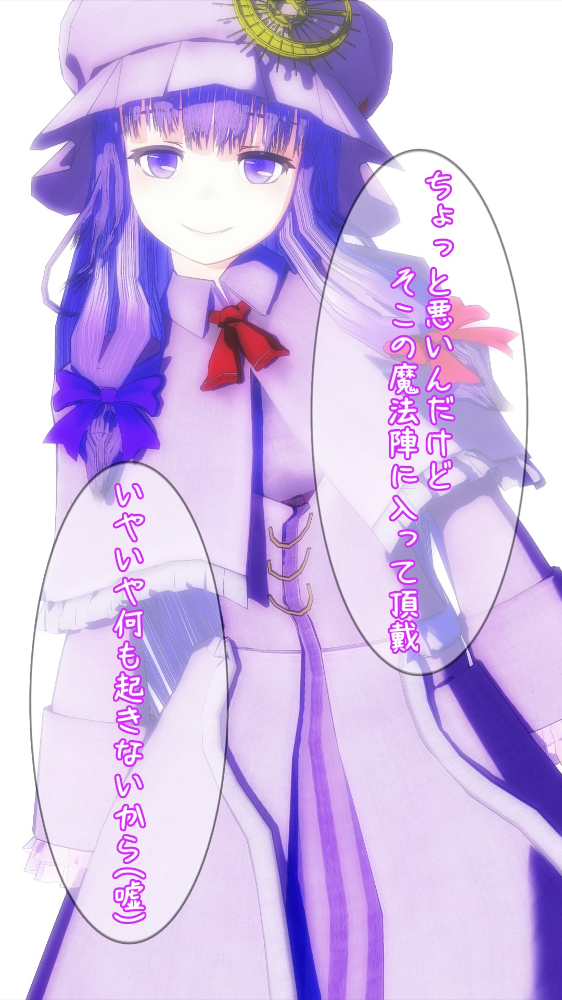
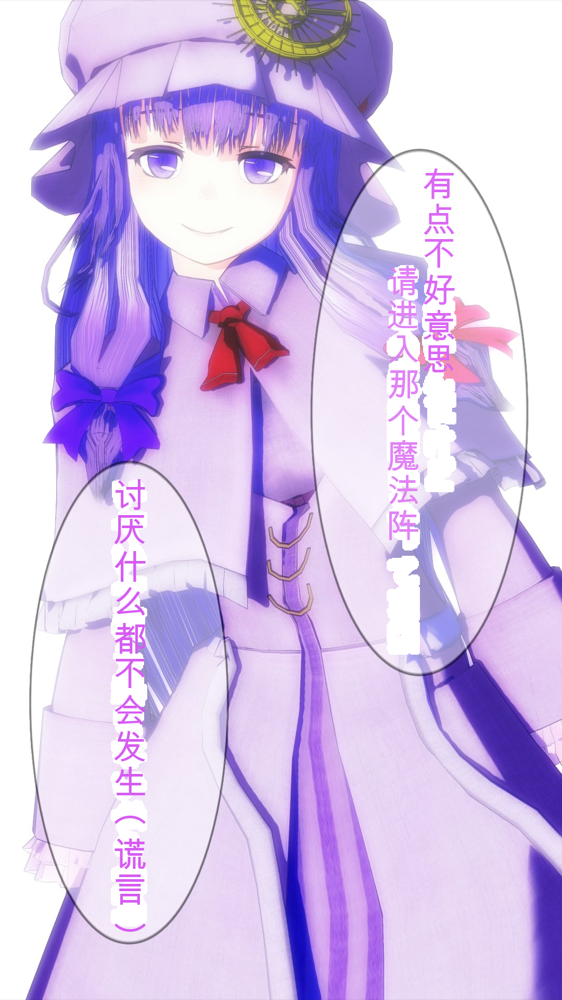
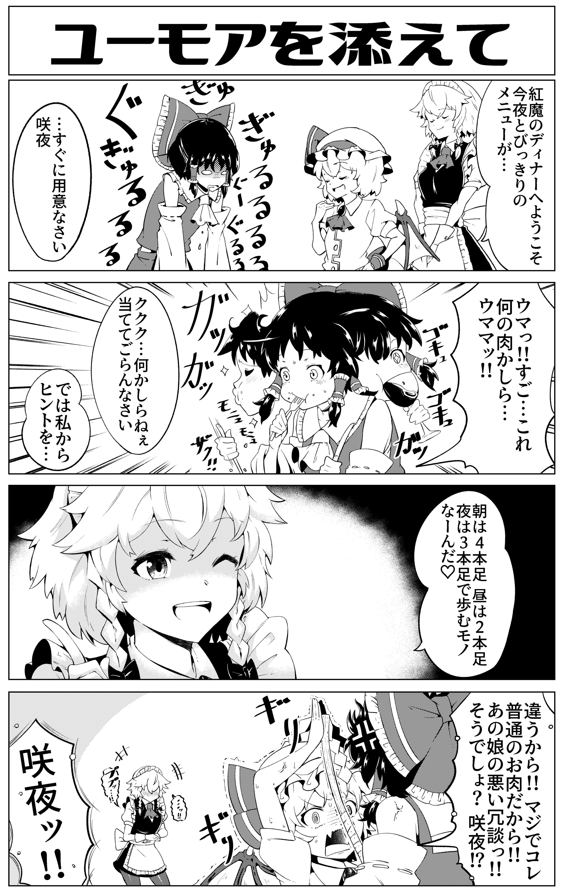
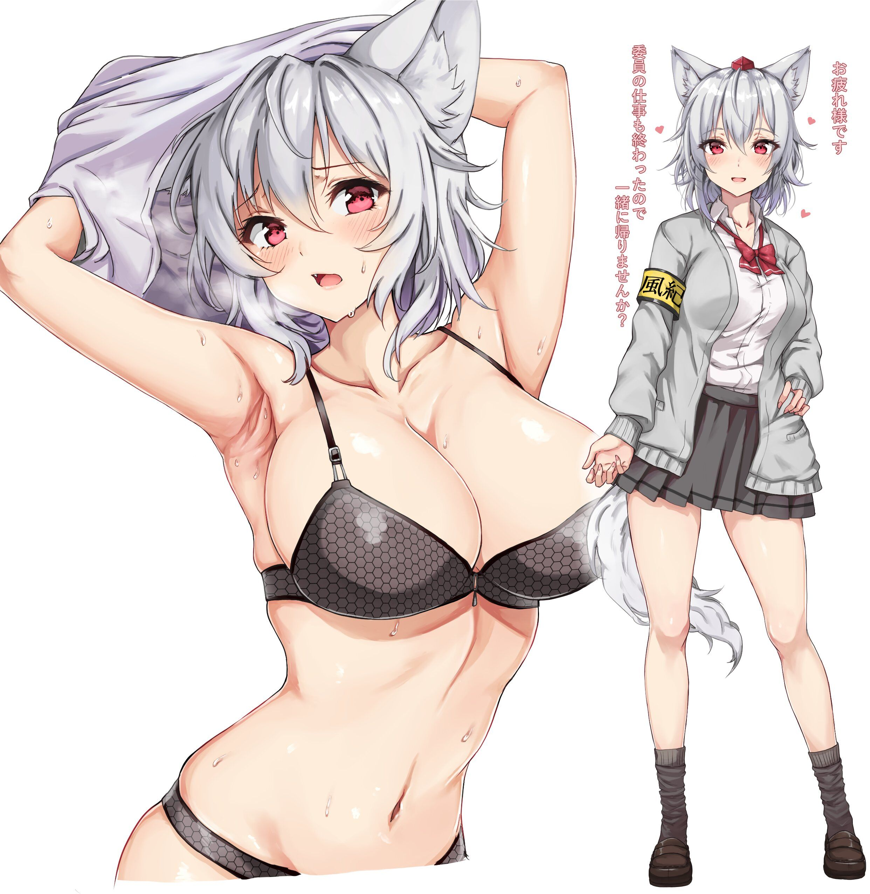

# 在线版
https://touhou.ai/imgtrans/
Note this may not work sometimes due to stupid google gcp kept restarting my instance. In that case you can wait for me to restart the service, which may take up to 24 hrs.
# English README
[README_EN.md](README_EN.md)
# 一键翻译各类图片内文字
针对群内、各个图站上大量不太可能会有人去翻译的图片设计，让我这种日语小白能够勉强看懂图片\
主要支持日语，不过也能识别汉语和小写英文 \
支持简单的涂白和嵌字 \
该项目是[求闻转译志](https://github.com/PatchyVideo/MMDOCR-HighPerformance)的v2版本

# 使用说明
1. clone这个repo
2. [下载](https://github.com/zyddnys/manga-image-translator/releases/tag/alpha-v2.2)ocr.ckpt、detect.ckpt和inpainting.ckpt，放到这个repo的根目录下
3. 申请百度翻译API，把你的appid和密钥存到key.py里
4. 运行`python translate_demo.py --image <图片文件路径> [--use-inpainting] [--use-cuda]`，结果会存放到result文件夹里。请加上`--use-inpainting`使用图像修补，请加上`--use-cuda`使用GPU。
# 只是初步版本，我们需要您的帮助完善
这个项目目前只完成了简单的demo，依旧存在大量不完善的地方，我们需要您的帮助完善这个项目！

# 下一步
完善这个项目
1. <s>图片涂改目前只是简单的涂白，图片修补的模型正在训练中！</s>图片修补基于[Global and Local Attention-Based Free-Form Image Inpainting](https://www.mdpi.com/1424-8220/20/11/3204)，但是根据[Brock, A. et al.](https://arxiv.org/abs/2101.08692)提出的方法修改去除了所有norm层，目前只有Coarse阶段。
2. 【重要，请求帮助】目前的文字渲染引擎只能勉强看，和Adobe的渲染引擎差距明显，我们需要您的帮助完善文本渲染！
3. <s>我尝试了在OCR模型里提取文字颜色，均以失败告终，现在只能用DPGMM凑活提取文字颜色，但是效果欠佳，我会尽量完善文字颜色提取，如果您有好的建议请尽管提issue</s>
4. 文本检测目前不能很好处理英语和韩语，等图片修补模型训练好了我就会训练新版的文字检测模型。
5. 文本渲染区域是根据检测到的文本，而不是汽包决定的，这样可以处理没有汽包的图片但是不能很好进行英语嵌字，目前没有想到好的解决方案。
6. [Ryota et al.](https://arxiv.org/abs/2012.14271)提出了获取配对漫画作为训练数据，训练可以结合图片内容进行翻译的模型，未来可以考虑把大量图片VQVAE化，输入nmt的encoder辅助翻译，而不是分框提取tag辅助翻译，这样可以处理范围更广的图片。这需要我们也获取大量配对翻译漫画/图片数据，以及训练VQVAE模型。
7. 求闻转译志针对视频设计，未来这个项目要能优化到可以处理视频，提取文本颜色用于生成ass字幕，进一步辅助东方视频字幕组工作。甚至可以涂改视频内容，去掉视频内字幕。

# 效果图
原始图片             |  翻译后图片
:-------------------------:|:-------------------------:
|
|
|
|
# Citation
```
@inproceedings{baek2019character,
  title={Character region awareness for text detection},
  author={Baek, Youngmin and Lee, Bado and Han, Dongyoon and Yun, Sangdoo and Lee, Hwalsuk},
  booktitle={Proceedings of the IEEE/CVF Conference on Computer Vision and Pattern Recognition},
  pages={9365--9374},
  year={2019}
}
@article{hinami2020towards,
  title={Towards Fully Automated Manga Translation},
  author={Hinami, Ryota and Ishiwatari, Shonosuke and Yasuda, Kazuhiko and Matsui, Yusuke},
  journal={arXiv preprint arXiv:2012.14271},
  year={2020}
}
@article{oord2017neural,
  title={Neural discrete representation learning},
  author={Oord, Aaron van den and Vinyals, Oriol and Kavukcuoglu, Koray},
  journal={arXiv preprint arXiv:1711.00937},
  year={2017}
}
@article{uddin2020global,
  title={Global and Local Attention-Based Free-Form Image Inpainting},
  author={Uddin, SM and Jung, Yong Ju},
  journal={Sensors},
  volume={20},
  number={11},
  pages={3204},
  year={2020},
  publisher={Multidisciplinary Digital Publishing Institute}
}
@article{brock2021characterizing,
  title={Characterizing signal propagation to close the performance gap in unnormalized ResNets},
  author={Brock, Andrew and De, Soham and Smith, Samuel L},
  journal={arXiv preprint arXiv:2101.08692},
  year={2021}
}
@inproceedings{fujimoto2016manga109,
  title={Manga109 dataset and creation of metadata},
  author={Fujimoto, Azuma and Ogawa, Toru and Yamamoto, Kazuyoshi and Matsui, Yusuke and Yamasaki, Toshihiko and Aizawa, Kiyoharu},
  booktitle={Proceedings of the 1st international workshop on comics analysis, processing and understanding},
  pages={1--5},
  year={2016}
}
```